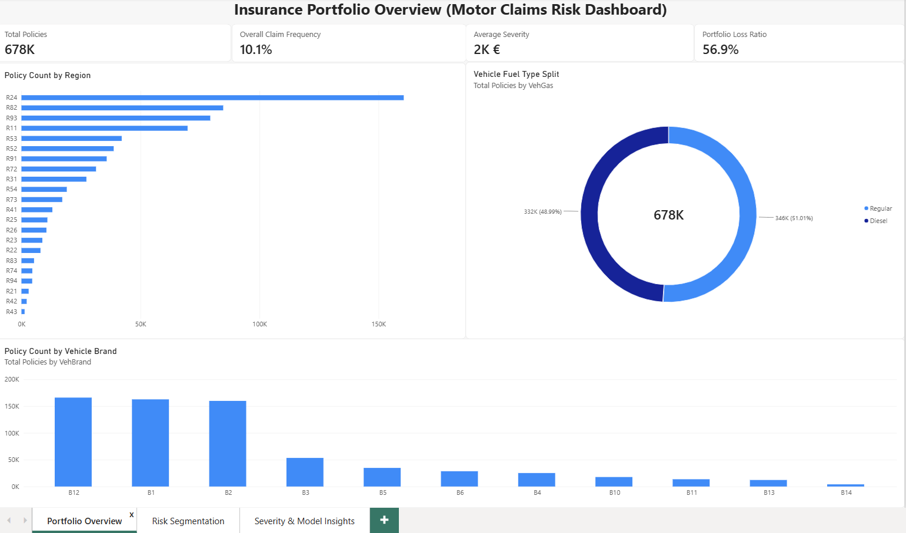
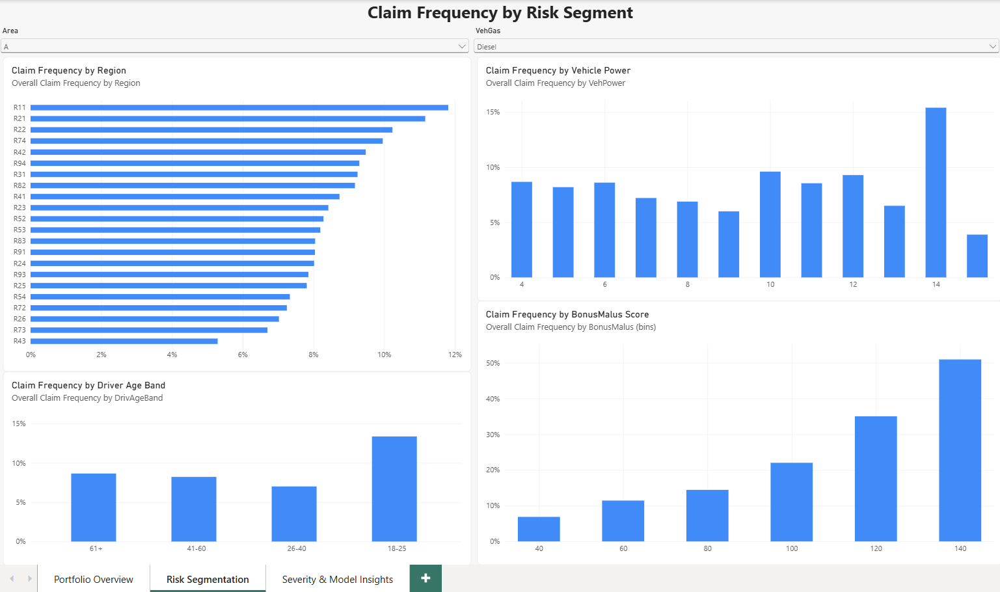
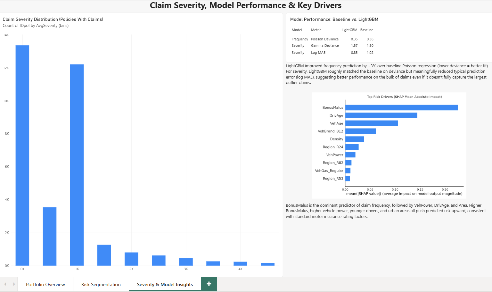
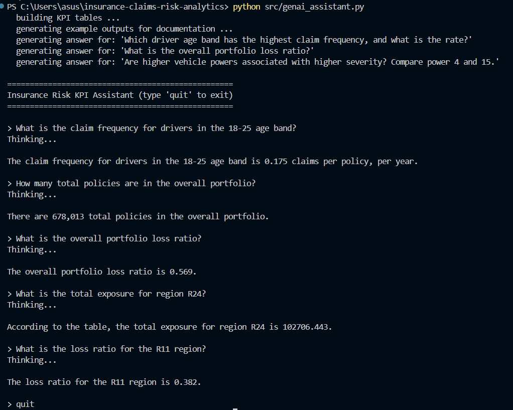
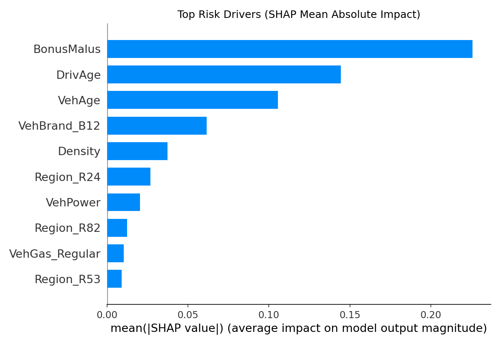
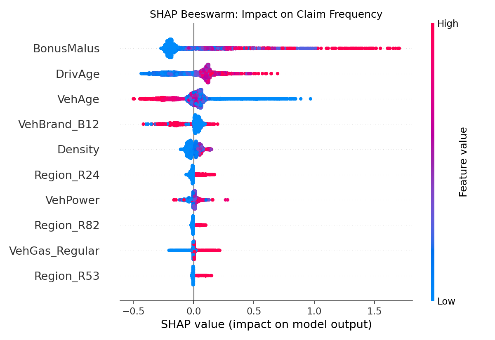

# Insurance Claims Risk Analytics


An end-to-end data analytics and predictive modeling pipeline for motor insurance claims. This project demonstrates full-stack data science and Business Intelligence capabilities, transitioning from raw actuarial data engineering to machine learning, model explainability (SHAP), Power BI dashboarding, and a Natural Language GenAI assistant.

## 1. Overview and Architecture
This repository contains a complete pipeline that:
1. Ingests and cleans actuarial data in ARFF format.
2. Engineers pricing-relevant features (Age bands, simulated premiums, claim frequency and severity).
3. Performs Exploratory Data Analysis (EDA) on key risk factors.
4. Visualizes portfolio risk through an interactive Power BI dashboard.
5. Trains baseline Generalized Linear Models (GLMs) and advanced LightGBM models for claim frequency and severity.
6. Explains model predictions using SHAP values.
7. Provides an interactive LLM-powered assistant (via Ollama) to answer business questions over the data.

## 2. Business Intelligence Dashboard
The project includes a comprehensive Power BI dashboard designed for underwriters and portfolio managers to analyze claim frequencies, severities, and geographic risk concentrations.

**Interactive Report Files:**
* [Download Power BI Dashboard (.pbix)](dashboard/insurance_claims_dashboard.pbix)
* [View Dashboard Report (.pdf)](dashboard/insurance_claims_dashboard.pdf)

### Dashboard Previews
<details open>
<summary>Click to view screenshots</summary>

<br>
<div align="center">
  
  <br><br>
  
  <br><br>
  
</div>
</details>

## 3. GenAI Actuarial Assistant
The repository includes a Natural Language query assistant powered by Ollama (or OpenAI) that answers business questions using pre-aggregated KPI tables locally, ensuring data privacy.

<div align="center">
  
</div>

**Example Queries:**
* "What is the claim frequency for drivers in the 18-25 age band?"
* "What is the overall portfolio loss ratio?"

## 4. Data Source
The dataset used is the **freMTPL2** dataset, a standard actuarial benchmark containing risk features and claim records for 678,000 motor insurance policies in France. Originally compiled for the [CASdatasets package in R](http://cas.uqam.ca/), it is widely used in actuarial pricing literature.
* `freMTPL2freq`: Policy characteristics (exposure, vehicle power, driver age, bonus-malus) and claim counts.
* `freMTPL2sev`: Individual claim amounts.

## 5. Machine Learning and Explainability
We benchmark simple Generalized Linear Models (GLMs) against advanced LightGBM gradient boosting models to predict both the frequency and severity of claims.

### Predictive Model Results
* **Frequency (Poisson Deviance)**: LightGBM (0.345) outperformed the baseline Poisson GLM (0.356) by 3%.
* **Severity (Gamma Deviance)**: Baseline Gamma GLM (1.503) slightly outperformed LightGBM (1.566), highlighting that simple GLMs often generalize better on heavy-tailed severity data. Both achieved a Log-MAE of around 0.85 to 1.02.

### SHAP Model Explainability
To ensure our LightGBM model is interpretable for regulatory compliance, we applied SHAP (SHapley Additive exPlanations). 

<div align="center">
  
  
</div>

## 6. Key Findings
* **Bonus-Malus** is the strongest predictor of claim frequency, validating its use in the French market. Higher scores (worse driving records) strongly drive up predicted frequency.
* **Young Drivers (18-25)** exhibit substantially higher claim frequencies than older cohorts.
* **Urban Concentration**: Region R11 has one of the highest claim rates despite its large exposure, suggesting a high-risk metropolitan effect (likely Paris).
* **Vehicle Power**: Mid-to-high power vehicles (categories 9+) show elevated risk.
* **Severity Distribution**: Claim amounts are highly right-skewed, requiring log-transformations and Gamma distributions for accurate modeling.

## 7. How to Run Locally

1. **Clone the repository**
   ```bash
   git clone https://github.com/afrit-med-rayan/insurance-claims-risk-analytics.git
   cd insurance-claims-risk-analytics
   ```

2. **Install dependencies**
   ```bash
   pip install -r requirements.txt
   ```

3. **Data Placement**
   Place `freMTPL2freq.arff` and `freMTPL2sev.arff` in the `data/raw/` folder.

4. **Run the End-to-End Pipeline**
   ```bash
   python src/run_pipeline.py
   ```
   This executes cleaning, feature engineering, EDA, modeling, and explainability sequentially.

5. **Run the GenAI Assistant**
   *(Requires Ollama installed locally with the llama3.2 model)*
   ```bash
   python src/genai_assistant.py
   ```

## 8. Repository Structure
```text
├── data/
│   ├── raw/                 # Raw ARFF files
│   └── processed/           # Cleaned and engineered features
├── dashboard/               # Power BI reports and screenshots
├── notebooks/               # Fully executed Jupyter notebooks (EDA, Modeling, SHAP)
├── reports/                 # Output metrics, findings, GenAI examples
│   └── figures/             # EDA and SHAP charts
├── src/                     # Source code modules
│   ├── load_data.py
│   ├── clean_data.py
│   ├── feature_engineering.py
│   ├── eda.py
│   ├── model_frequency.py
│   ├── model_severity.py
│   ├── explainability.py
│   ├── genai_assistant.py
│   └── run_pipeline.py
├── tests/                   # Pytest unit tests
├── requirements.txt         # Project dependencies
└── README.md                # Project documentation
```

## 9. License
This project is licensed under the [MIT License](https://opensource.org/licenses/MIT).
